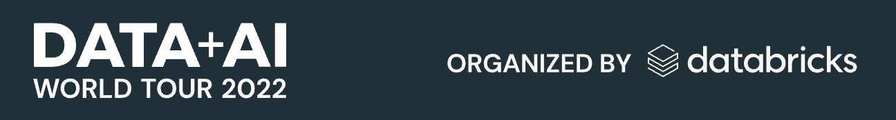

# Delta Lake: From Data Lake to Lakehouse

This notebook was prepared for [my talk](https://dataengconf.com.au/conference/schedule) at the [**DataEngBytes** conference](https://dataengconf.com.au/conference/sydney) held on 2022-09-29 in Sydney, Australia.

- Author: Vinoaj (Vinny) Vijeyakumaar (vinoaj@gmail.com, vinny.vijeyakumaar@databricks.com)
- _Opinions are my own and not the views of my employer_

## Demo Objectives

Delta Lake provides ACID transactions, scalable metadata handling, and unifies streaming and batch data processing on top of existing data lakes. 

In this demo, we will touch upon Delta Lake's more powerful features:
* ACID transactions
* DML support
* Unify batch & streaming
* Time Travel
* Zero copy clones
* Change data feeds
* ... and more!

### The Data

The data used in this demo is from the Kaggle competition [`predict-closed-questions-on-stack-overflow`](https://www.kaggle.com/competitions/predict-closed-questions-on-stack-overflow/overview).

### The Environment
This notebooks is setup to run in a Databricks Workspace. Databricks clusters are already set up with Spark, Delta Lake, and their respective SDKs (e.g. PySpark). This notebook was developed using **DBR 11.2** (_Spark 3.3.0_)

To set up Delta Lake in a non-Databricks environment, please [follow these instructions](https://docs.delta.io/latest/quick-start.html)

---

# Upcoming Databricks Events
## (Free & in-person!) Data+AI World Tour Sydney

[🔗 Registration link](https://www.databricks.com/dataaisummit/worldtour/sydney)
Our lineup of data and AI experts, leaders and visionaries includes [Matei Zaharia](https://www.linkedin.com/in/mateizaharia), co-founder Apache Spark and Databricks. 

Come spend the day with Lakehouse experts and practitioners from across Australia and New Zealand. Learn howlocal entrprises and startups are pushing the Lakehouse boundaries!

## (Free & in-person!) Databricks Bootcamps
[🔗 Registration link](https://pages.databricks.com/00-202202-APJ-FE-Databricks-Bootcamp-2022-q4-Router_LP---Registration-page.html?utm_source=databricks&utm_medium=vinny&utm_campaign=7013f000000LkDCAA0)

We're holding **free** Databricks Bootcamps across Brisbane, Sydney, Melbourne, Adelaide, Perth, and Auckland over Oct - Dec.

Led by Databricks instructors, these sessions will use real-world data sets as we go under the hood to demonstrate how to use robust technologies such as Delta Lake, Databricks SQL and MLflow

---

# Further Reading & Resources
- VLDB Paper: 
- O'Reilly book:
- Book 2: 
- 